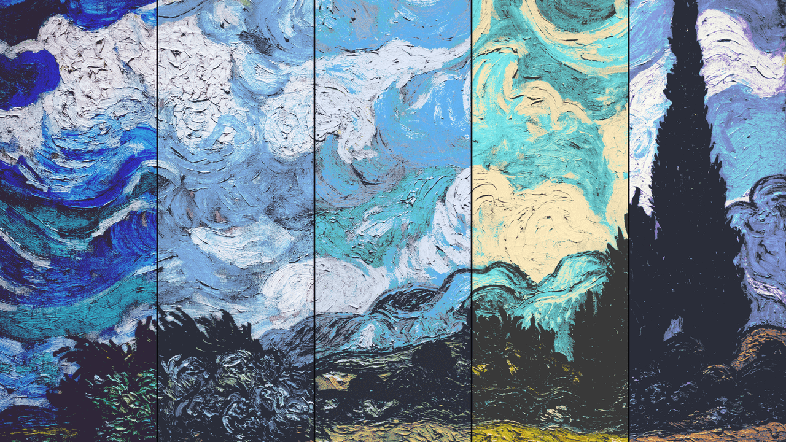
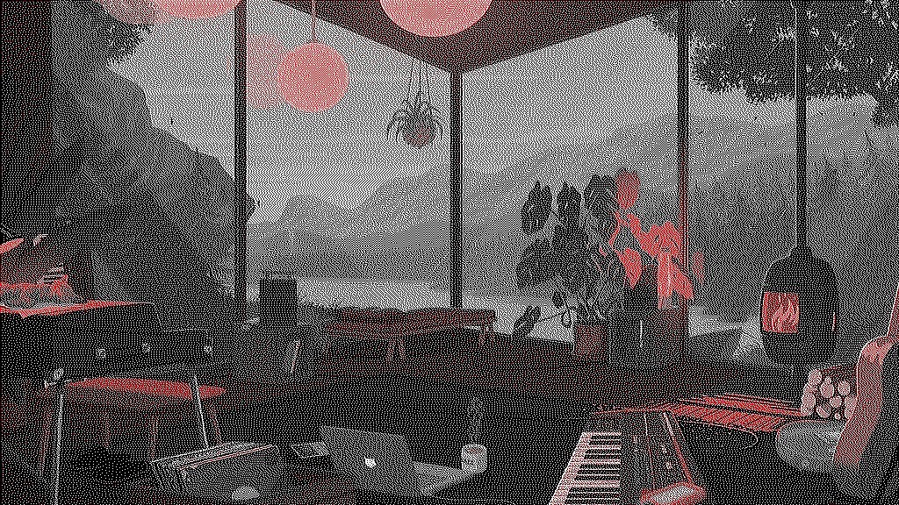
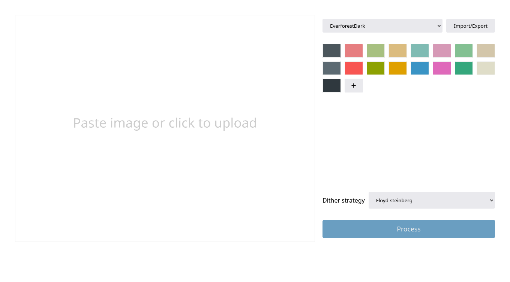

# Repalette

Repalette is an image colorizer written in C. It is available as both a CLI
utility and a web application.



## Features

- Recolor images using nearest neighbor search.
- Optional dithering for smoother results.

**Web-version:**

- WASM-powered web application (mostly for mobile usage)
- Fetch color schemes from [Gosh](https://gogh-co.github.io/Gogh/)
- Support for both text-based and color-picker-based palette editing
- Responsive layout and adaptive light/dark theme

## Benchmark

- Processor: Intel® Core™ i5-8300H Processor
- Input: 7680x4320 JPEG image
- Color palette: [Nord](http://nordtheme.com/)
- Average of 10 runs

| Dithering algorithm       | Mean (s) | %slower |
| ------------------------- | -------- | ------- |
| No dithering              | 2.398    | 0       |
| Floyd-Steinberg           | 3.831    | 60      |
| Atkinson                  | 3.746    | 56      |
| Jarvis, Judice, and Ninke | 4.892    | 104     |
| Burkes                    | 4.091    | 70      |
| Sierra                    | 4.566    | 90      |
| Sierra lite               | 3.683    | 53      |

To run the benchmark yourself:

- Install [hyperfine](https://github.com/sharkdp/hyperfine)
- Build the CLI version
- Put an image with the name `input.jpg` in the same directory as `benchmark.sh`
- Run `./benchmark.sh`

## Building

**You need:**

- For native build: Any C compiler that supports C99.
- For WASM build: Clang, LLVM, and LLD.
- GNU make.

Build everything with Clang

```
make
```

Only build the native version with GCC

```
make repalette CC=gcc
```

**Note:**

Repalette uses `stb_image` and `stb_image_write` for working with images.
They're automatically downloaded as make dependencies using `wget`.

## Usage

### CLI version

```yaml
USAGE:
  repalette -h | --help
  repalette <input file> <output file> [options]

OPTIONS:
  -p, --palette COLOR[,COLOR...]
  -d, --dither  none | floyd-steinberg | atkinson | jjn | burkes | sierra | sierra-lite
```

- The default color palette is `000000,ffffff` (black and white)
- The default dithering algorithm is `floyd-steinberg`

Example:

```
repalette input.jpg output-no-dither.png -p 000000,ff0000,ffffff --dither none
repalette input.jpg output-burkes.png -p 000000,ff0000,ffffff --dither burkes
```

| input.jpg          | output-no-dither.png          | output-burkes.png          |
| ------------------ | ----------------------------- | -------------------------- |
|  |  |  |

### Web version

Host the website with any server or go to <https://ziap.github.io/repalette>.

The user interface:



## License

This project is licensed under the [AGPL-3.0 license](LICENSE).
